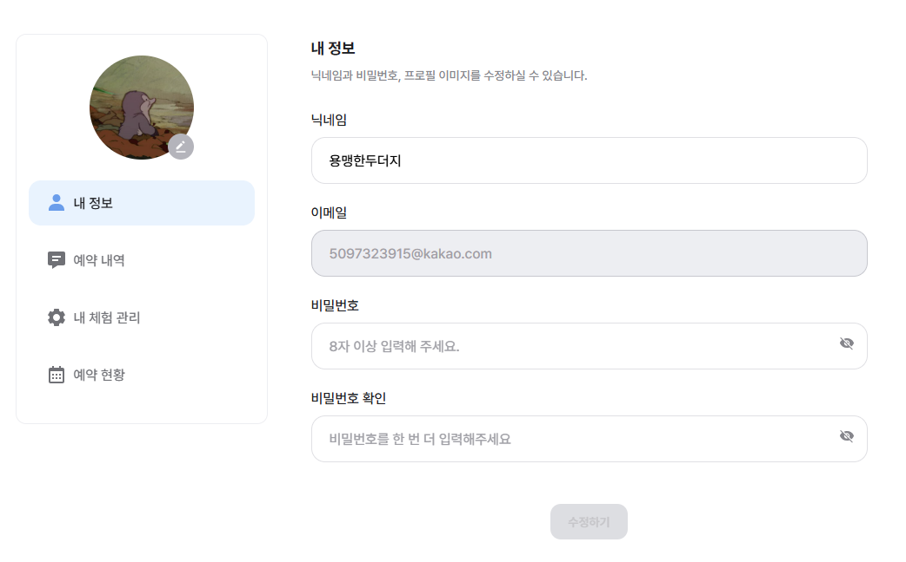
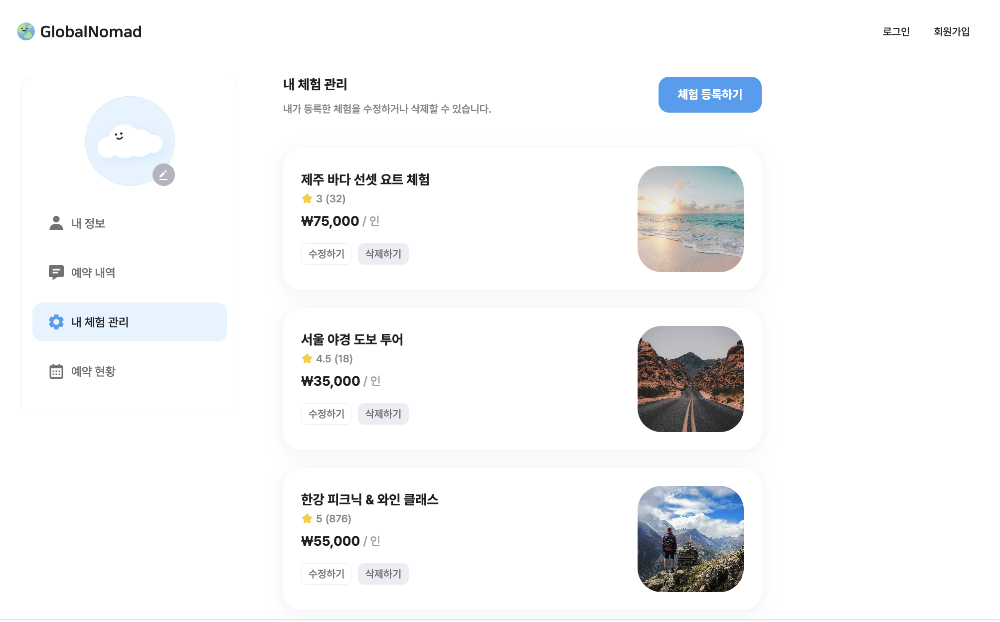

# GlobalNomad

> Codeit 부트캠프 팀 프로젝트([원본 레포](https://github.com/Codeit-FE19-Part4-Team6/GlobalNomad.git))를 포크하여,
> 포트폴리오 정리를 위해 개인적으로 리팩토링을 추가한 레포입니다.

다양한 체험 활동을 검색하고 예약할 수 있는 **체험 예약 플랫폼** GlobalNomad입니다.
사용자는 원하는 체험을 탐색·예약하고, 체험 제공자는 자신의 체험을 등록·관리할 수 있는 React 웹 애플리케이션입니다.

- 🔗 팀 프로젝트 원본 레포: https://github.com/Codeit-FE19-Part4-Team6/GlobalNomad.git
- 🌐 Web (시연용 배포): https://global-nomad-team6.vercel.app/
  > ※ Live Demo는 팀 원본 레포 기준 배포본입니다. 포크 레포에는 포트폴리오용 리팩토링이 추가로 반영되어 있습니다.

## Screenshots

|                            마이페이지 · 내 정보                            |                           마이페이지 · 내 체험 관리                            |
| :--------------------------------------------------------------------------: | :----------------------------------------------------------------------------: |
|  |  |

|                          메인 페이지 (체험 목록)                          |                          체험 상세 페이지                          |
| :-------------------------------------------------------------------------: | :-------------------------------------------------------------------------: |
|  |  |

## Tech Stack

- **Framework**: React 19 · Vite 7
- **Routing**: React Router 
- **Language**: TypeScript 
- **State & Data Fetching**: TanStack Query, Zustand, Axios
- **Styling**: Tailwind CSS v4 · tailwind-merge · tailwind-variants · clsx
- **Form**: React Hook Form
- **외부 서비스**: Kakao Maps SDK, Kakao OAuth, react-daum-postcode(주소 검색)
- **Linting & Formatting**: ESLint, Prettier, Husky + lint-staged, commitlint

## Prerequisites

- Node.js: 20.19 이상 (Vite 7 요구 사항)

## Getting Started

### 1. Install Dependencies

```bash
npm install
```

### 2. Environment Variables Setup

루트 폴더에 `.env` 파일을 생성하고 아래 값을 설정합니다.

```env
VITE_API_BASE_URL=https://sp-globalnomad-api.vercel.app/19-6
VITE_KAKAO_REST_API_KEY=your_kakao_rest_api_key
VITE_KAKAO_JS_KEY=your_kakao_js_key
```

### 3. Run the Development Server

```bash
npm run dev
```

기본적으로 `http://localhost:3000`에서 실행됩니다.

### Linting & Formatting

이 프로젝트는 코드 스타일 유지와 오류 방지를 위해 ESLint와 Prettier를 사용합니다.

```bash
npm run lint
```

Husky + lint-staged가 설정되어 있어, 커밋 시 변경된 파일에 대해 `eslint --fix` / `prettier --write`가 자동으로 실행됩니다.

## 담당 기능

4인 팀 프로젝트로 진행했으며, 프론트엔드 전반을 팀원들과 함께 개발했습니다. 그중 직접 담당한 부분은 다음과 같습니다.

- **공통 컴포넌트**: Title, Label, Textarea, Badge, Dropdown, Card(Compound Component Pattern), Avatar, DatePicker, 이미지 업로드 폼, 카드 사이드바, 사이드바 버튼, Logo, Favicon
- **마이페이지**: 내 정보 관리(MyProfile), 예약 내역(Reservation), 내가 등록한 체험 관리(MyExperiences — 등록·수정·삭제 전체 CRUD 지원) — 탭 구조 및 URL 쿼리 동기화(`useSearchParams`)
- **무한 스크롤**: 내 체험 목록, 예약 내역 목록

> 그 외 화면(메인, 체험 상세, 로그인/회원가입 등)과 API 연동은 다른 팀원들이 담당했으며, 아래 리팩토링은 팀 담당 구분과 무관하게 프로젝트 전체 코드베이스를 대상으로 진행했습니다.

## 이 포크에서 진행한 리팩토링

원본 레포의 기능은 그대로 유지하면서, 아래 항목들을 포트폴리오 정리 목적으로 추가 진행했습니다.

- 중복 로직(DRY) 제거: 날짜 포맷팅 · 페이지 이탈 확인 · 에러 처리 · 무한 스크롤 · 카드 UI 등 반복 로직을 훅/컴포넌트/유틸로 추출
- 결합도 낮추기: 하드코딩되어 있던 라우트 경로 · 카테고리 · 상태값을 상수로 통합
- 가독성 · 네이밍 개선: 긴 함수 분리, 불명확한 변수명 정리
- 아키텍처 개선: 폴더 구조 재정리, `main.tsx`에 있던 라우팅 설정을 `router.tsx`로 분리
- 불필요한 코드(Dead code) 제거: 미사용 파일 · 함수 · 의존성 정리
- 에러 처리 일원화: 여러 곳에서 각자 구현되어 있던 axios 에러 메시지 추출 로직을 공통 함수로 통합

## 라이선스

이 프로젝트는 학습 목적으로 제작되었습니다.
